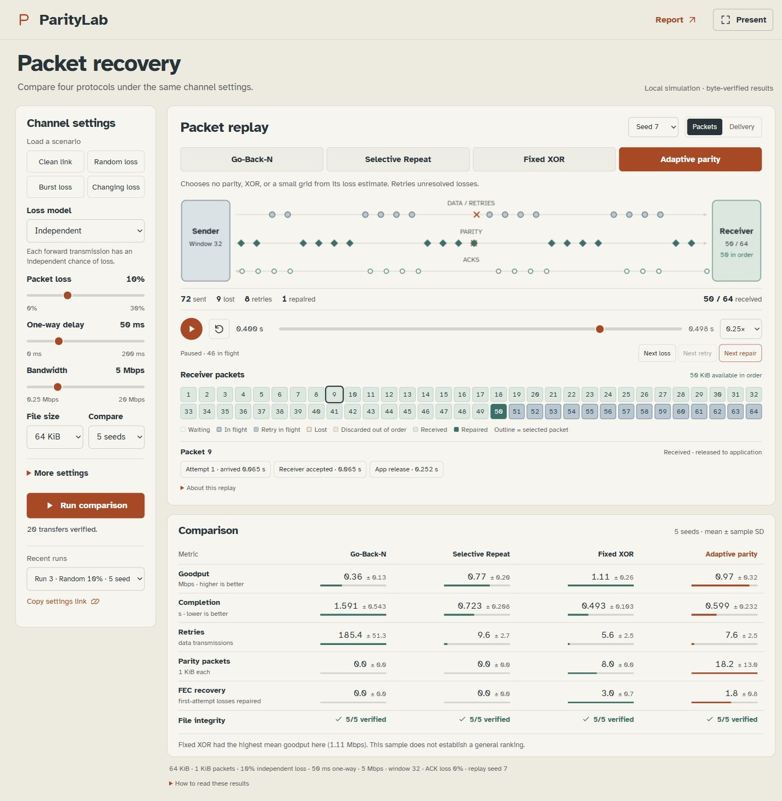

# ParityLab

ParityLab is a local testbed for packet recovery experiments. It compares Go-Back-N, Selective Repeat, fixed XOR parity, and adaptive parity using the same file and configured network conditions. Run an experiment, replay its packets, inspect the protection decisions, and check the received bytes.

The project includes a deterministic simulator, a three-process UDP transport, a browser interface, and reproducible studies. The core runs on Python 3.10 or newer with no third-party dependencies.

The research manuscript, [Decoder risk and finite-transfer tradeoffs in adaptive packet parity](output/pdf/paritylab-paper.pdf), is an empirical study of the recorded experiments. It separates known-model decoder calibration, estimated protection targets, and useful throughput. It preserves cases where fewer retries accompany lower goodput and where matched-budget code rankings change under burst loss. The paper claims neither a new coding algorithm nor general superiority for adaptive parity.

The [paper directory](paper/README.md) includes editable Markdown and standalone LaTeX, five figures, nine tables, a claim-to-evidence map, the literature search record, and an internal review. References are dated 2020-2026. Author declarations and a venue remain to be confirmed before submission.



## Quick start

Clone the repository and create an environment:

```sh
git clone https://github.com/aswanth-07/paritylab.git
cd paritylab
python -m venv .venv
```

Activate it on Windows PowerShell:

```powershell
.\.venv\Scripts\Activate.ps1
```

Or on macOS/Linux:

```sh
source .venv/bin/activate
```

Then install and start the interface:

```sh
python -m pip install -e .
python -m paritylab demo
```

Open [http://127.0.0.1:8770](http://127.0.0.1:8770). Keep the terminal open; Ctrl+C stops the server. Use `--port 8771` if the port is occupied. The UI, fonts, and reports are included in the wheel and work offline. There is no frontend build step.

## Run a comparison

Choose a preset or set the loss model, packet loss, delay, bandwidth, and file size, then select **Run comparison**. Choose **1 seed** for a single run per protocol or **5 seeds** for five sequential seeds. The five-seed table reports each metric as mean ± sample standard deviation and checks all 20 transfers. It does not perform a significance test.

Select a protocol tab and play or scrub its recorded transmissions. Data and retries, parity, and acknowledgments have separate lanes. **Next loss**, **Next retry**, and **Next repair** seek to recorded events. Select a receiver packet to inspect its attempts, acceptance, and application release. The packet map distinguishes a received packet from bytes available in order.

Switch to **Delivery** to compare all four application-delivery curves for the replay seed. Selecting another replay seed changes the recording and controller decisions; the comparison table still summarizes the full seed group. **Present** hides the introduction and lower explanatory panels so the experiment can lead a presentation.

The adaptive decisions panel shows the loss estimate, selected mode, predicted failure risk, and whether the model target was feasible. Select a decision to seek to that block. Recent runs retain the last five completed groups for the current page session. **Copy settings link** saves the completed group's settings, seed count, and selected protocol in a URL that reruns them on the same local server. Downloads also retain recorded settings after you change the controls: CSV includes every trial; JSON includes transmissions, receiver events, and controller decisions.

The **Real UDP transfer** panel sends a separate 32 KiB file through sender, impairment proxy, and receiver processes. It verifies the actual received file and records all three process IDs. This uses operating-system sockets and wall time; the replay uses simulated time. A completed receipt keeps its original settings and remains available if the next transfer fails.

See the [presentation walkthrough](docs/ui-demo.md) for clean, burst, and changing-loss examples.

## Protocols and protection policies

| Protocol | Recovery behavior |
| --- | --- |
| Go-Back-N | Cumulative acknowledgments; discard out-of-order data; retry the outstanding window after a timeout. |
| Selective Repeat | Buffer out-of-order data; acknowledge individual packets; retry missing packets with individual timers. |
| Fixed XOR | Selective Repeat plus one XOR repair packet per block of up to eight data packets by default. |
| Adaptive parity | Selective Repeat plus a choice of no parity, one XOR repair, or row/column XOR repairs for each block. |

The adaptive controller chooses the lowest parity overhead among candidates whose predicted probability of unrepaired block data is at most 1%. It accounts for lost repair packets. If none meets the target, it records infeasibility and chooses the lowest predicted failure probability. Remaining losses are recovered by retransmission.

Three policies are available through `--controller-policy`:

- `legacy`: an exponentially weighted loss estimate under independent erasures; the UI and saved baseline use this policy.
- `uncertainty`: approximate loss intervals and risk calculations for the actual partial-block size.
- `burst`: fitted binary Markov transitions and a risk envelope when ordered observations provide enough information; otherwise an explicit independent-model fallback.

The XOR/grid decoder repairs equations with one missing data symbol until no further repair is possible. A rectangle of four grid erasures can stop this peeling decoder. Exact small-block risk calculations use that same decoding rule.

## Command line

Compare all four protocols in simulated time:

```sh
python -m paritylab simulate --scheme all --loss 0.10 --output output/comparison.json
```

Test reliable metadata, acknowledgment loss, and reordering:

```sh
python -m paritylab simulate --scheme adaptive --metadata-mode reliable --metadata-loss 0.3 --ack-loss 0.1 --jitter-ms 3 --reorder-probability 0.2 --reorder-delay-ms 10
```

Evaluate the burst-aware policy:

```sh
python -m paritylab simulate --scheme adaptive --model gilbert-elliott --controller-policy burst --loss 0.10
```

Send a file through all four UDP implementations:

```sh
python -m paritylab socket-run --scheme all --input path/to/file --output output/socket
```

The socket transport uses sliding windows, CRC framing, repeated block descriptors, retried manifests, and final SHA-256 confirmation. Data, repair, acknowledgment, feedback, and completion messages pass through the impairment proxy. It supports loss, delay, bandwidth limits, jitter, reordering, duplication, and corruption, with bounded retries and runtime. Child processes are cleaned up on success and failure.

`udp-demo` is a smaller block-at-a-time example with control traffic exempt from injected loss. Use `socket-run` for the full protocol. Run `python -m paritylab --help` or a command's `--help` for all options.

## Recorded experiments

| Study | Saved sample | Purpose |
| --- | --- | --- |
| Baseline | 260 transfers | Independent-loss sweep, burst loss, and changing loss across five seeds. |
| Sensitivity | 370 transfers | Change delay, capacity, window, timeout, symbol/block size, or burst duration separately. |
| Equal parity budget | 160,000 decoder trials | Compare codecs with identical erasure masks at 50% and 100% parity payload budgets. |
| Socket transport | 36 transfers | Verify all four protocols under independent, burst, and combined control/data impairment. |
| Shared bottleneck | 70 runs / 140 flows | Compare finite-FIFO contention using a teaching AIMD controller. |
| Risk calibration | 3,060,000 decoder trials | Check exact independent/Markov predictions against the byte decoder. |
| Estimated policies | 225,000 trials | Evaluate fitted parameter intervals, risk envelopes, and fallback behavior. |

These are separate experiments. The baseline and sensitivity tables report means and sample standard deviations, not confidence intervals. Matching seeds across protocols gives the same configured conditions; different send schedules consume random draws differently. Only the equal-budget codec study explicitly pairs identical erasure masks.

Adaptive parity can reduce retries while consuming more bandwidth. It does not always maximize goodput, and fixed XOR can outperform it. Read the [experiment report](docs/project-report.md) for the measured comparisons and the [model definitions](docs/model.md) for metric boundaries.

## Reproduce and verify

Correctness tests use the standard library:

```sh
python -m unittest discover -s tests -v
```

Install the optional plotting and report dependencies to reproduce all artifacts:

```sh
python -m pip install -e ".[plots,reports]"
python scripts/reproduce.py --calibration
python scripts/verify.py
python scripts/build_proposal.py
python scripts/build_report.py
python scripts/audit_pdfs.py
python scripts/build_release.py
```

Omit `--calibration` to reuse the recorded calibration while rerunning the transport studies. The full calibration runs millions of trials. On Windows, `.\scripts\ready.ps1 -Calibration` performs the complete sequence; `.\scripts\ready.ps1` verifies the saved studies and rebuilds the reports and package.

Every study has a manifest with settings, seed rules, and source/artifact SHA-256 fingerprints. `scripts/verify.py` checks the tests, reference years, raw record counts, received bytes, and measurement provenance. The recorded paper studies use an earlier measured revision, preserved in `output/measured-source/` with a checksum index. The audit verifies every recorded source hash against the current checkout or that immutable archive, and reports `source_current: false` for historical matches. A verified archive does not make old studies measurements of the current source.

Require measurements of the current checkout with:

```sh
python scripts/audit_measurements.py --require-current
```

That command rejects the historical studies until you reproduce them. Normal verification still checks their archived source and every saved artifact; missing or changed source bytes fail. `scripts/build_release.py` builds a source archive and wheel, installs the wheel in a fresh environment, runs the suite, and checks socket transfers and offline assets outside the checkout.

Use `python scripts/verify.py --no-write` to run the same checks without rewriting the verification receipt or test transcript.

For the recorded plotting/report environment, install `requirements-reproduction.txt` on Python 3.10. The core has no dependency lock because it uses only the standard library. Optional UI source checks use Node.js 22.13 or newer: run `npm ci`, `npm run lint`, and `npm test`. Frontend tests check replay state, event seeking, sample deviation, and CSV contents. Node.js is not needed to run the demo.

The large congestion JSON and equal-budget CSV are stored as lossless `.gz` files. Their manifests hash the original uncompressed bytes, and the audit reads either form. Reproduction writes raw local copies and refreshes the compressed copies. Git preserves file bytes, including line endings, so a checkout retains the recorded source hashes. Release archives and local browser-review files are generated locally rather than committed.

## Project structure

| Path | Contents |
| --- | --- |
| `src/paritylab/channel.py` | Link serialization, delay, and seeded impairment models. |
| `src/paritylab/fec.py`, `controller.py` | Binary codecs, exact decoder risks, and adaptive protection policies. |
| `src/paritylab/simulation.py` | Event-driven single-flow transport and recorded replay events. |
| `src/paritylab/wire.py`, `socket_transport.py` | Framing and three-process UDP transfers. |
| `src/paritylab/congestion.py` | Shared finite queue and competing-flow evaluation. |
| `src/paritylab/experiments.py`, `studies.py`, `calibration.py`, `evaluation.py` | Registered studies, summaries, and plots. |
| `src/paritylab/server.py`, `web/` | Local API, browser controls, replay, and exports. |
| `tests/` | Codec, controller, transport, API, queue, and study checks. |
| `scripts/` | Reproduction, provenance audits, reports, and package verification. |
| `output/` | Raw results, summaries, manifests, plots, PDFs, and verification receipts. |

## Contribution and novelty

The project contributes an inspectable implementation and experimental workflow: raw first-attempt loss feedback, decoder-aware risk calculations, explicit uncertainty/fallback reporting, and comparisons spanning simulation, real loopback datagrams, and matched-budget codec trials.

Adaptive FEC, XOR repair, row/column parity, and hybrid FEC/ARQ are established techniques. This repository does not claim a new coding algorithm or a proved research novelty. A stronger method claim would need a focused prior-art comparison and controlled evaluation of the specific controller change.

## Limitations

- The 1% failure target is conditional on the selected model and its estimates. Approximate intervals can miss; changing, hidden-state, or non-Markov loss does not inherit a stationary-model guarantee.
- The UDP protocol binds to loopback and lacks peer authentication, encryption, and an Internet congestion controller. CRC and SHA-256 checks detect accidental errors; they do not authenticate a sender.
- The shared AIMD evaluator is a teaching model. Its fairness and timing results do not establish TCP/QUIC compatibility or Internet performance.
- Virtual-time results and socket wall-clock results have different timing boundaries. Operating-system scheduling changes real socket arrival order and timings.
- The UI supports one or five seeds per protocol. These small interactive samples are separate from the registered experiment suite and do not establish a general performance ranking.

## Documentation and references

- [Experiment report](docs/project-report.md) and [PDF](output/pdf/project-report.pdf).
- [Proposal](docs/proposal.md) and [PDF](output/pdf/proposal-2020-2026.pdf).
- [Socket protocol](docs/socket-protocol.md), [model definitions](docs/model.md), and [verification coverage](docs/readiness.md).
- [Experiment data provenance and limits](DATASET_CARD.md).
- [2020–2026 bibliography](docs/references.bib) and [reference audit](docs/reference-audit.json). Drafts and preprints are identified as such.
- [Contributing](CONTRIBUTING.md) and [security policy](SECURITY.md).

The project is available under the [MIT License](LICENSE). The self-hosted Atkinson Hyperlegible fonts are distributed under the [SIL Open Font License](web/assets/fonts/OFL.txt).
