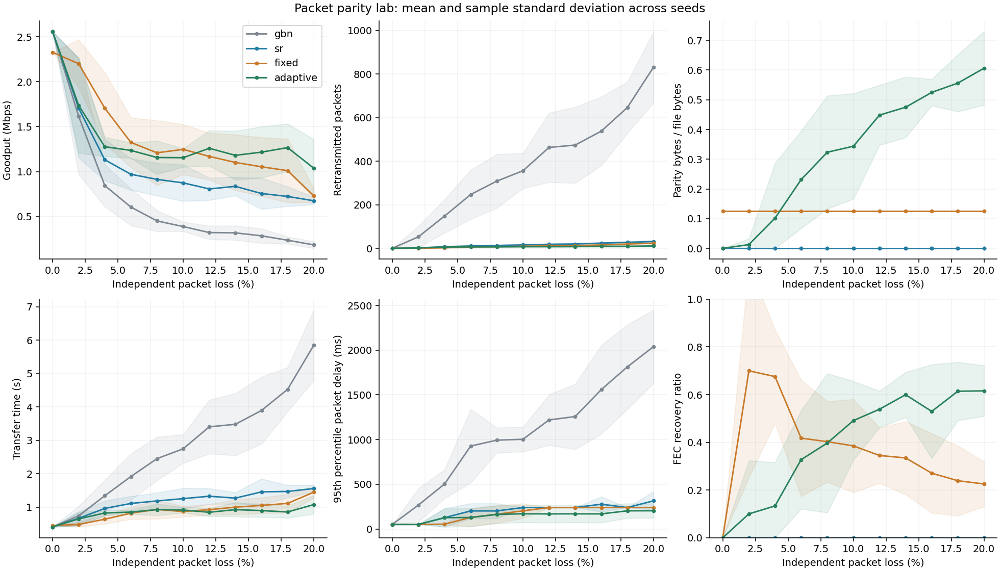
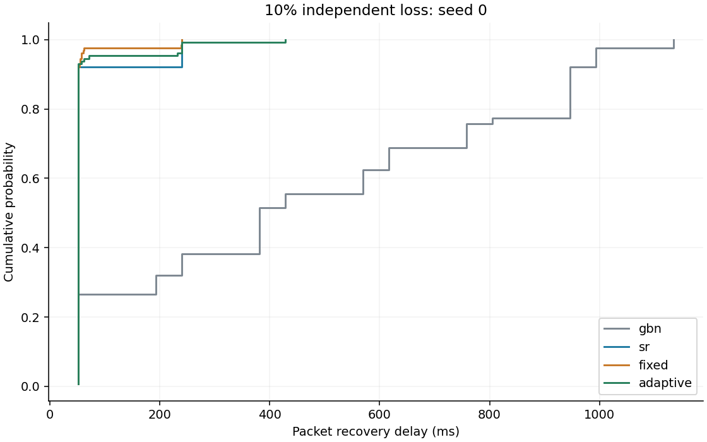
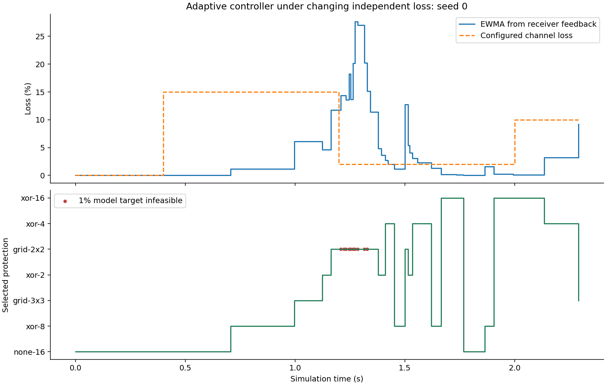
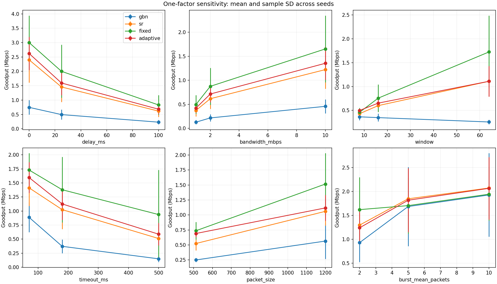
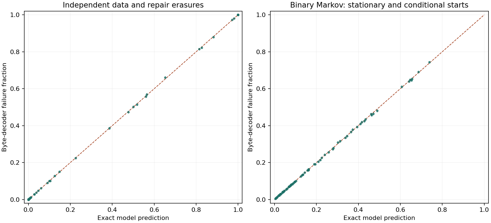
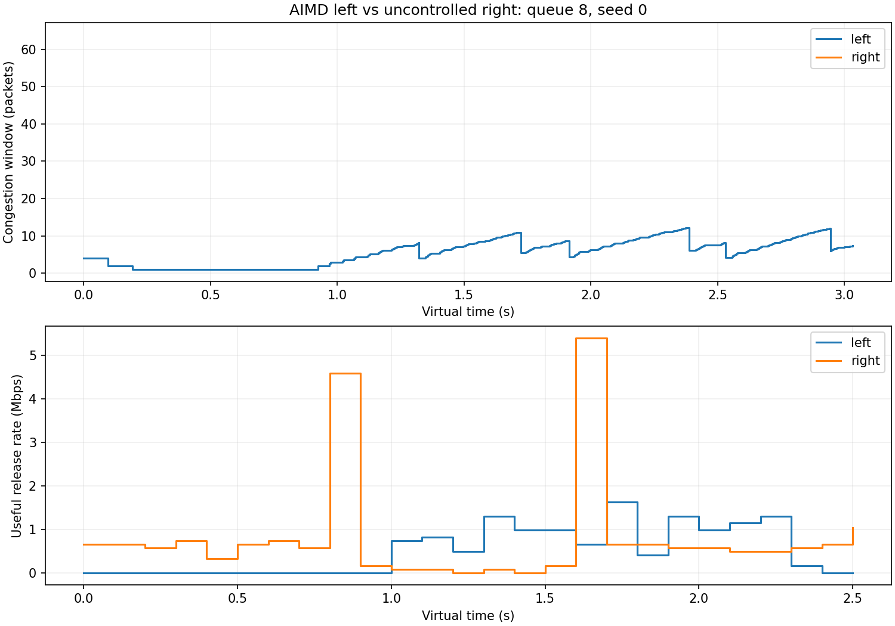

# ParityLab: measured packet reliability

Author: A Aswanth Raj

Local experimental evaluation, October 2026

## Outcome

The project implements Go-Back-N, Selective Repeat, fixed XOR parity, and adaptive parity over actual byte payloads. It includes a deterministic event-driven emulator, a three-process localhost UDP transport, a responsive presentation interface with recorded replay, and reproducible raw experiments. The bibliography contains 11 sources dated 2020-2026, checked on 2026-10-07. Recent journal articles, preprints and expired drafts are labeled separately.

The current suite passes 90 tests. Saved evidence covers 260 baseline transfers, 370 one-factor sensitivity transfers, 70 shared-bottleneck runs (140 flow transfers), 36 three-process socket transfers, 160,000 equal-overhead codec trials, 3,060,000 calibration decoder trials, and 225,000 estimated-policy trials. Completed transport outputs are checked against the input bytes and digest. These counts describe separate experiments, not one pooled sample.

The current correctness tests cover this release. Some saved studies describe an earlier measured revision preserved in output/measured-source/. Verification checks the archived source bytes and each recorded artifact. These historical measurements are not new measurements of this release.

Adaptive parity reduces recovery work in some tested conditions and costs bandwidth in others. The legacy independent-loss controller does not consistently improve goodput under bursts. The 1% block-failure target is conditional on the fitted loss model; it is not an unconditional delivery or Internet performance guarantee.

## Implementation and protocol

The emulator serializes forward and reverse links independently, adds one-way propagation delay, and applies seeded independent or binary Gilbert-Elliott erasures. Optional jitter, reordering, ACK loss, reliable metadata, and changing loss phases test protocol robustness. A separate shared finite FIFO bottleneck evaluates two competing flows with a teaching AIMD congestion window that charges data, parity, and retries to the same flight budget.

Go-Back-N accepts only the next sequence at the receiver, returns cumulative ACKs, and retries the outstanding window on a base timeout. Selective Repeat buffers out-of-order symbols, selectively ACKs them, and uses per-sequence timers. Fixed and adaptive FEC add parity to Selective Repeat; residual losses still use ARQ. XOR and iterative row/column peeling operate on padded binary symbols and preserve the original file length. A four-corner grid erasure can stop peeling even when all repair packets survive.

The real transport launches separate sender, receiver, and impairment-proxy processes for each scheme. A retried manifest, repeated block descriptors, CRC-protected binary framing, raw first-attempt feedback, and retried final SHA-256 confirmation make control loss visible and recoverable. All messages traverse the proxy. Duplicate/corrupt/reordered messages and permanent loss are tested with explicit retry and runtime bounds. CRC detects accidental corruption; it does not authenticate a sender.

## Experimental protocol and metrics

The baseline uses 128 KiB files (512 KiB for changing loss), 1 KiB symbols, window 32, 5 Mbps bandwidth, 50 ms one-way delay, and five seeds (0-4). Eleven loss settings from 0% through 20% at two-point intervals, one 10% burst condition, and one changing-loss condition produce 260 transfers. The changing channel starts clean and changes at 0.4, 1.2, and 2.0 seconds. Each scheme receives identical configured conditions and seeds; different transmission schedules consume different random draws, so these are not identical loss masks.

| Metric | Definition |
| --- | --- |
| Goodput | Original file bits / receiver completion seconds / 1,000,000 |
| Receiver completion | Last original file byte becomes available |
| Sender completion | Original data ACKs received; socket runs also confirm the final digest |
| Retry count | Every original-data send after its first attempt |
| Recovery delay | Receiver availability minus first send; nearest-rank p95 |
| Application delay | In-order release minus first send; head-of-line wait measured separately |
| Parity overhead | Parity payload bytes / original file bytes |
| FEC recovery ratio | First-attempt data losses reconstructed before retransmission / first-attempt losses |

Means are accompanied by sample standard deviation across seeds; this is not a confidence interval. Socket wall-clock measurements include framing and operating-system scheduling and are kept separate from virtual-time results. Forward emulator sizes are accounting assumptions; socket wire counters measure actual framed UDP payload bytes, excluding IP/UDP headers.

## Baseline results

| Condition | Scheme | Goodput Mbps, mean +/- SD | Retries, mean +/- SD | Parity / file |
| --- | --- | --- | --- | --- |
| 0% independent | gbn | 2.559 +/- 0.000 | 0.0 +/- 0.0 | 0.000 |
| 0% independent | sr | 2.559 +/- 0.000 | 0.0 +/- 0.0 | 0.000 |
| 0% independent | fixed | 2.327 +/- 0.000 | 0.0 +/- 0.0 | 0.125 |
| 0% independent | adaptive | 2.559 +/- 0.000 | 0.0 +/- 0.0 | 0.000 |
| 10% independent | gbn | 0.388 +/- 0.053 | 356.0 +/- 80.9 | 0.000 |
| 10% independent | sr | 0.874 +/- 0.202 | 15.6 +/- 3.6 | 0.000 |
| 10% independent | fixed | 1.247 +/- 0.279 | 9.6 +/- 3.9 | 0.125 |
| 10% independent | adaptive | 1.154 +/- 0.102 | 7.6 +/- 2.2 | 0.344 |
| 20% independent | gbn | 0.185 +/- 0.039 | 831.8 +/- 163.6 | 0.000 |
| 20% independent | sr | 0.675 +/- 0.043 | 31.4 +/- 4.6 | 0.000 |
| 20% independent | fixed | 0.731 +/- 0.076 | 23.6 +/- 5.9 | 0.125 |
| 20% independent | adaptive | 1.038 +/- 0.323 | 11.0 +/- 3.1 | 0.606 |
| burst | gbn | 1.124 +/- 0.446 | 83.8 +/- 67.3 | 0.000 |
| burst | sr | 1.479 +/- 0.317 | 10.6 +/- 6.4 | 0.000 |
| burst | fixed | 1.465 +/- 0.244 | 8.4 +/- 4.9 | 0.125 |
| burst | adaptive | 1.443 +/- 0.312 | 9.6 +/- 4.9 | 0.106 |
| changing | gbn | 0.614 +/- 0.088 | 907.6 +/- 195.5 | 0.000 |
| changing | sr | 1.210 +/- 0.171 | 32.4 +/- 11.1 | 0.000 |
| changing | fixed | 1.602 +/- 0.141 | 16.6 +/- 6.1 | 0.125 |
| changing | adaptive | 1.556 +/- 0.087 | 13.6 +/- 3.5 | 0.318 |

Fixed XOR can outperform the adaptive risk-target controller: minimizing parity subject to modeled block risk does not directly maximize goodput. The baseline is retained as a comparison for the legacy policy; uncertainty and burst policies are additional explicit options, not silently substituted into these results.

## Robustness and controlled comparisons

The 36 socket experiments test each scheme over three seeds under independent data/ACK loss, burst loss, and combined metadata loss, jitter, reordering, duplication, and corruption. All completed files match the input digest and have three distinct process IDs. Reliable metadata and in-order delivery tests demonstrate that unavailable early symbols hold later application bytes until the gap is repaired. Permanent metadata loss has a bounded failure result and does not write a successful output file.

The sensitivity study changes one factor at a time from the baseline: delay, capacity, window, timeout, symbol width, fixed XOR block size, or mean burst run length. It contains 370 verified transfers. The equal-overhead study holds the parity budget exactly at 50% or 100%, using identical erasure masks within each codec pair. Its 160,000 trials separate decoder structure from redundancy budget; they do not measure transport goodput. Wilson columns for correlated burst trials are descriptive rather than valid coverage guarantees.

## Risk calibration and policy limits

Exact independent and binary Markov predictions were tested in 153 conditions across five seeds and 4,000 trials per seed: 3,060,000 byte-decoder trials. There were zero incorrect recovered bytes. All exact predictions fell within the registered simultaneous 99% sampling-error check. The largest absolute prediction error was 0.00915; five individual approximate 95% Wilson intervals missed their exact predictions. Those checks have different coverage and are reported separately.

Using an independent model for stationary bursts produced an error up to 0.18469; ignoring the specified preceding loss raised it to 0.63695. The burst policy fits transition parameters from ordered raw first-attempt observations and uses a risk envelope when enough transitions exist. Count-only or noncontiguous feedback does not invent adjacent observations. Partial-block predictions evaluate the actual admitted size for the optional policies.

Estimated-policy validation uses 225,000 further trials. Active Markov envelopes showed no violations when their estimated parameter rectangle contained the truth. Approximate intervals sometimes excluded the truth; independent fallback, changing loss, hidden-state emissions, and unequal data/parity loss do not receive a burst-risk guarantee. Calibrating a known stationary decoder model does not establish an end-to-end transport guarantee.

## Congestion evaluation

Seventy runs transfer two 256 KiB files through one finite FIFO link at 2 Mbps and 20 ms one-way delay with 1% channel and ACK loss, queue capacities 8 and 32, and five seeds. Configurations include equal AIMD, equal uncontrolled senders, AIMD versus uncontrolled, and every scheme versus Selective Repeat. All 140 flow outputs are verified. Jain fairness uses actual in-order useful bytes during the common active interval, rather than requested rates or total sent symbols. Equal AIMD settings still have finite-file start/tail effects and unequal shares.

The congestion evaluator is a teaching model with ACK-clocked growth and timeout reduction, not RFC-compliant TCP/QUIC. Its block descriptors are out of band; reliable metadata is tested separately. Go-Back-N reliability sequence timers remain independent of congestion flight slots so ACKs for discarded attempts cannot accidentally cancel data recovery. The real socket implementation remains a bounded loopback transport without Internet congestion control.

## Review 2 update and recent literature

A separate frozen evaluation compares cost-based parity selection plus early receiver feedback with the original risk-target method, fixed XOR, Selective Repeat, and two component comparisons. It contains 1,440 byte-verified transfers: twelve conditions, twenty held-out seeds and six methods. The geometric mean ratio of condition-mean goodput across eleven nonclean conditions is 1.264 (+26.4%) against original adaptive. On the 1 Mbps condition the increase is 64.5% against original adaptive and 17.6% against fixed XOR. These are simulator results, not real UDP or Internet speed claims. Fixed XOR wins several other conditions; the short changing-loss case finishes before a change. Review 2 results and the complete study retain those limits.

The new method prices parity serialization against modeled retry cost and uses receiver block status to retry unresolved originals before a timer when possible. The codecs remain XOR and row/column parity; the cost score and exponential symbol-count weight are local adaptations. Historical tables above retain their original risk-target controller and measured source.

Recent context includes Tsubaki et al. (2026) on RS-protected multipath QUIC, Zheng and Liu (2026) on recovered-packet reports, Chen et al. (2025) on adaptive FEC and matrix feedback in LTP, Eghbal and Lu (2025) on partial-order screen delivery, and Wang et al. (2026) on measured satellite loss models. The latter two are used only at abstract level. The LTP trained policy, QUIC frames, RS codec, partial-order delivery and satellite model are not implemented here. The lab comparison is between this project's methods, not those papers' numerical results.

## Requirement-to-evidence matrix

| Deliverable | Implementation | Verification artifact |
| --- | --- | --- |
| Four sliding-window schemes | simulation.py, socket_transport.py | tests.txt; experiments/runs.json; socket-evaluation/runs.json |
| XOR / grid codecs and partial tail | fec.py | CodecTests; calibration/verification.json |
| Adaptive raw-loss feedback | controller.py | ControllerTests; recorded controller traces |
| Reliable impaired metadata and in-order release | simulation.py, wire.py, socket_transport.py | SimulatorTests; SocketTransportTests; socket-evaluation |
| Uncertainty and burst-aware policies | controller.py, calibration.py | calibration/raw-trials.csv.gz; policy-validation.csv |
| Multi-seed loss / burst / changing studies and plots | experiments.py | 260 runs; summary.csv; CDF and timeline |
| Sensitivity and matched parity budgets | studies.py | 370 transfers; 160,000 paired decoder trials |
| Shared capacity and congestion behavior | congestion.py, evaluation.py | 70 runs; queue bounds and common-interval fairness |
| Interactive lab presentation | web/, server.py | output/verification/ui.json; frontend tests; recorded exports |
| Reproducible installation and offline assets | setup.py; scripts/ready.ps1 | output/release/verification.json; checksums.json |
| Reviewed 2020-2026 bibliography | docs/proposal.md; references.bib | docs/reference-audit.json; reference year check |

## Running and reproducing

Install Python 3.10 or newer. From the source bundle, run python -m pip install -e . and python -m paritylab demo, then open http://127.0.0.1:8770. The wheel includes the same UI, local fonts, proposal, and report. No frontend build, account, or online asset is needed after installation. The UI socket button selects any of the four protocols and downloads its actual receipt. Emulator replay stays paused until requested.

On Windows, .\scripts\ready.ps1 checks the saved evidence, runs the current suite, rebuilds PDFs, and makes a verified release. Add -Reproduce to rerun baseline, sensitivity, paired-codec, congestion, and socket experiments. Add -Calibration to regenerate the full calibration too. Equivalent portable Python commands are in README.md. The measurement audit accepts current source bytes or a checksum-verified archive of the measured revision and reports which was used. Use python scripts/audit_measurements.py --require-current to require fresh measurements of the checkout; historical matches fail that check. Regenerate the relevant measurements rather than relabeling old hashes.

The source bundle contains raw records, scripts, tests, figures, PDFs, bibliography, and the offline UI. The release verification installs the wheel in a fresh environment, runs the full suite from outside the checkout, fetches UI assets and both PDFs, and transfers binary bytes using every socket scheme. A checksum manifest accompanies the ZIP and wheel. Timings on a different machine will differ, especially for sockets.

## Limitations and conclusion

The delivered scope is a local academic lab. It has no cryptographic peer authentication, path-MTU discovery, production congestion-controlled socket transport, or Internet field trial. Binary first-order packet-index Markov erasures are simpler than real network bursts. Default emulator descriptors remain idealized unless reliable metadata is selected. Five-seed summaries are small condition-specific samples; they do not prove universal rankings. Candidate risk infeasibility and finite transfer budgets are explicit failure modes.

The project makes the parity/retransmission tradeoff inspectable: a presenter can change conditions, replay recorded packets, explain applied protection choices, verify actual socket bytes, and trace each reported result back to raw data. Modern prior work already studies adaptive FEC; this contribution is an educational implementation and controlled evaluation, not a claim of a new transport standard.

## References (2020-2026)

[1] V. Roca and B. Teibi. Sliding Window Random Linear Code (RLC) Forward Erasure Correction (FEC) Schemes for FECFRAME. RFC 8681, January 2020. DOI: 10.17487/RFC8681. [Source](https://www.rfc-editor.org/rfc/rfc8681.html).

[2] F. Golaghazadeh, S. Coulombe, and J.-M. Robert. Residual packet loss rate analysis of 2-D parity forward error correction. Signal Processing: Image Communication 102, 116597, March 2022. DOI: 10.1016/j.image.2021.116597. [Source](https://doi.org/10.1016/j.image.2021.116597).

[3] F. Michel, A. Cohen, D. Malak, Q. De Coninck, M. Medard, and O. Bonaventure. FlEC: Enhancing QUIC With Application-Tailored Reliability Mechanisms. IEEE/ACM Transactions on Networking 31(2), 606-619, April 2023. DOI: 10.1109/TNET.2022.3195611. Author manuscript: arXiv:2208.07741 (2022). [Source](https://doi.org/10.1109/TNET.2022.3195611).

[4] J. Iyengar and I. Swett. QUIC Loss Detection and Congestion Control. RFC 9002, May 2021. DOI: 10.17487/RFC9002. [Source](https://www.rfc-editor.org/rfc/rfc9002.html).

[5] N. Kuhn, E. Lochin, F. Michel, and M. Welzl. Forward Erasure Correction (FEC) Coding and Congestion Control in Transport. RFC 9265, July 2022. DOI: 10.17487/RFC9265. [Source](https://www.rfc-editor.org/rfc/rfc9265.html).

[6] D. Moskvitin, E. Onegin, R. Huang, H. Luo, and Q. Chen. Adaptive Forward Erasure Correction for Delay-Sensitive QUIC Connections. Internet-Draft draft-dmoskvitin-quic-adaptive-fec-00, May 6, 2024. This version expired November 7, 2024; work in progress, not an adopted standard. [Source](https://www.ietf.org/archive/id/draft-dmoskvitin-quic-adaptive-fec-00.html).

[7] T. Tsubaki, S. Anno, S. Komatsu, T. Torii, and T. Tojo. Scheduler-Agnostic Adaptive-FEC for MPQUIC: Field Evaluation over Commercial Cellular Paths. arXiv:2607.14482v1, July 16, 2026. DOI: 10.48550/arXiv.2607.14482. [Source](https://arxiv.org/abs/2607.14482).

[8] N. Eghbal and P. Lu. Lower-Latency Screen Updates over QUIC with Forward Error Correction. Future Internet 17(7), 297, June 30, 2025. DOI: 10.3390/fi17070297. [Source](https://doi.org/10.3390/fi17070297).

[9] L. Chen, Y. Song, K. Zhao, J. A. Fraire, and W. Li. Reliable Transmission of LTP Using Reinforcement Learning-Based Adaptive FEC. arXiv:2506.22470v1, June 19, 2025. DOI: 10.48550/arXiv.2506.22470. Author preprint. [Source](https://arxiv.org/abs/2506.22470).

[10] H. Zheng and Y. Liu. FEC Extension for QUIC. Internet-Draft draft-zheng-quic-fec-extension-02, March 16, 2026. Expired September 17, 2026; individual work in progress, not a standard. [Source](https://www.ietf.org/archive/id/draft-zheng-quic-fec-extension-02.html).

[11] T. Wang, T. Liu, Y. Li, J. Zhao, R. Gao, S. Wu, and J. Pan. Packet Loss Modeling and Forward Erasure Correction for LEO Satellite Networks. IEEE Transactions on Communications 74, 3999-4013, 2026. DOI: 10.1109/TCOMM.2026.3658383. [Source](https://doi.org/10.1109/TCOMM.2026.3658383).
