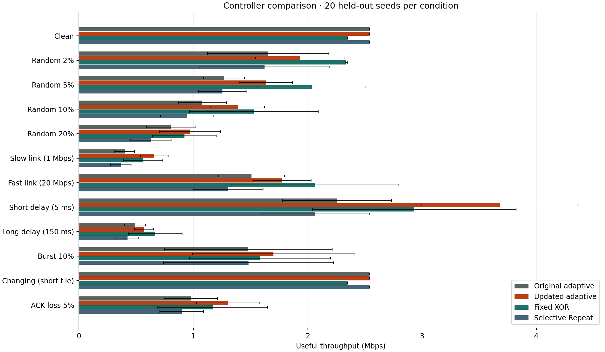
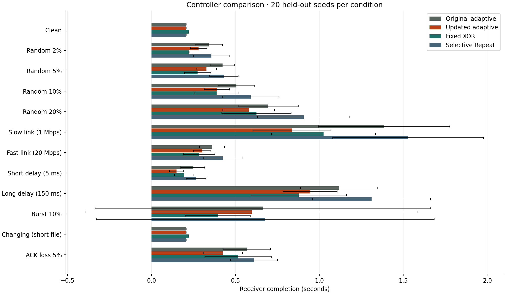

# Review 2 measured results

1,440 verified transfers: 12 conditions × 20 seeds × 6 methods. Final seeds 100–119 were not used for development. All files and in-order application hashes match.

64 KiB files, 1 KiB packets, window 32. Default one-way delay 50 ms and capacity 5 Mbps. Each changed parameter is named in the condition. Values are mean ± sample standard deviation; these are not confidence intervals.

The geometric mean goodput ratio to the original controller across the 11 nonclean conditions is 1.2641 (+26.4%). This is a ratio across the declared conditions, not a universal improvement.

| Condition | Original Mbps | Updated Mbps | Change | Fixed XOR Mbps | Selective Repeat Mbps |
| --- | --- | --- | --- | --- | --- |
| Clean | 2.542 ± 0.000 | 2.542 ± 0.000 | +0.0% | 2.348 ± 0.000 | 2.542 ± 0.000 |
| Random 2% | 1.655 ± 0.530 | 1.931 ± 0.387 | +16.7% | 2.337 ± 0.009 | 1.622 ± 0.566 |
| Random 5% | 1.268 ± 0.179 | 1.635 ± 0.235 | +29.0% | 2.034 ± 0.467 | 1.253 ± 0.207 |
| Random 10% | 1.078 ± 0.211 | 1.388 ± 0.234 | +28.7% | 1.528 ± 0.563 | 0.945 ± 0.233 |
| Random 20% | 0.804 ± 0.212 | 0.969 ± 0.268 | +20.6% | 0.921 ± 0.278 | 0.627 ± 0.179 |
| Slow link (1 Mbps) | 0.400 ± 0.086 | 0.658 ± 0.121 | +64.5% | 0.560 ± 0.172 | 0.366 ± 0.089 |
| Fast link (20 Mbps) | 1.508 ± 0.289 | 1.775 ± 0.253 | +17.7% | 2.064 ± 0.733 | 1.304 ± 0.306 |
| Short delay (5 ms) | 2.255 ± 0.477 | 3.678 ± 0.685 | +63.1% | 2.933 ± 0.889 | 2.064 ± 0.473 |
| Long delay (150 ms) | 0.488 ± 0.093 | 0.569 ± 0.084 | +16.7% | 0.667 ± 0.234 | 0.423 ± 0.099 |
| Burst 10% | 1.479 ± 0.733 | 1.699 ± 0.707 | +14.9% | 1.582 ± 0.616 | 1.482 ± 0.745 |
| Changing (short file) | 2.542 ± 0.000 | 2.542 ± 0.000 | +0.0% | 2.348 ± 0.000 | 2.542 ± 0.000 |
| ACK loss 5% | 0.977 ± 0.234 | 1.301 ± 0.275 | +33.1% | 1.169 ± 0.480 | 0.898 ± 0.191 |

## Completion, retries, and overhead

| Condition | Original → updated completion (s) | Original → updated retries | Original → updated parity (%) |
| --- | --- | --- | --- |
| Clean | 0.206 → 0.206 | 0.00 → 0.00 | 0.00 → 0.00 |
| Random 2% | 0.342 → 0.281 | 1.05 → 1.05 | 2.66 → 1.48 |
| Random 5% | 0.423 → 0.328 | 2.25 → 2.20 | 8.98 → 5.47 |
| Random 10% | 0.506 → 0.390 | 3.95 → 3.80 | 16.09 → 14.84 |
| Random 20% | 0.695 → 0.579 | 9.80 → 9.40 | 32.19 → 32.27 |
| Slow link (1 Mbps) | 1.386 → 0.837 | 3.90 → 4.20 | 16.64 → 8.28 |
| Fast link (20 Mbps) | 0.361 → 0.302 | 3.95 → 3.35 | 16.09 → 21.25 |
| Short delay (5 ms) | 0.246 → 0.150 | 3.95 → 4.20 | 16.33 → 8.28 |
| Long delay (150 ms) | 1.116 → 0.945 | 3.95 → 3.45 | 16.09 → 19.06 |
| Burst 10% | 0.663 → 0.598 | 6.65 → 6.65 | 6.02 → 5.78 |
| Changing (short file) | 0.206 → 0.206 | 0.00 → 0.00 | 0.00 → 0.00 |
| ACK loss 5% | 0.568 → 0.426 | 7.40 → 4.15 | 13.36 → 12.11 |

## Component comparison

Cost-only removes early feedback; original + feedback keeps the original parity objective. This separates the two changes. Most improvement comes from early recovery.

| Condition | Original | Cost only | Original + feedback | Updated |
| --- | --- | --- | --- | --- |
| Clean | 2.542 | 2.542 | 2.542 | 2.542 |
| Random 2% | 1.655 | 1.659 | 1.926 | 1.931 |
| Random 5% | 1.268 | 1.296 | 1.603 | 1.635 |
| Random 10% | 1.078 | 1.122 | 1.357 | 1.388 |
| Random 20% | 0.804 | 0.840 | 0.960 | 0.969 |
| Slow link (1 Mbps) | 0.400 | 0.400 | 0.629 | 0.658 |
| Fast link (20 Mbps) | 1.508 | 1.643 | 1.647 | 1.775 |
| Short delay (5 ms) | 2.255 | 2.231 | 3.520 | 3.678 |
| Long delay (150 ms) | 0.488 | 0.522 | 0.537 | 0.569 |
| Burst 10% | 1.479 | 1.480 | 1.698 | 1.699 |
| Changing (short file) | 2.542 | 2.542 | 2.542 | 2.542 |
| ACK loss 5% | 0.977 | 1.010 | 1.264 | 1.301 |

The changing-loss condition finishes before 0.25 s at this file size; it does not establish adaptation to a phase change. Fixed XOR is faster in several conditions. Burst results vary widely across seeds; mean goodput and mean completion need not rank methods the same way because averaging reciprocals changes the endpoint. Socket wall-time gains and significance were not evaluated.

The predeclared contract is in [controller-cost-contract.md](controller-cost-contract.md). Raw runs, all summaries, source hashes, and source archives are under `output/studies/controller-cost/`. Recompute the result with `python scripts/audit_controller_comparison.py`.
